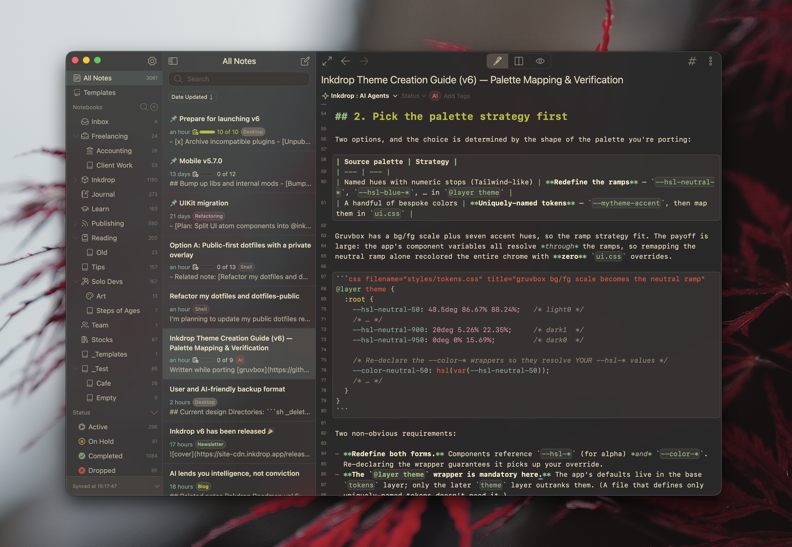

# gruvbox

[Gruvbox](https://github.com/morhetz/gruvbox) for Inkdrop — a retro groove color
scheme with warm, low-contrast surfaces and pastel accents. A single dark theme
covering the app UI, the editor syntax highlighting, and the Markdown preview.



<!-- Add your screenshot at docs/screenshot.png and reference it with a RELATIVE path
     (./docs/screenshot.png), not an absolute URL. The Inkdrop plugins website renders
     this README, and a relative path ships the image inside your package instead of
     loading it from a third-party server. -->

## How to install

```sh
ipm install gruvbox
```

Then enable it in **Preferences → Themes**.

## About the palette

The theme uses gruvbox's **dark background, medium contrast** variant. Its bg/fg
scale becomes Inkdrop's neutral ramp — `bg0` (#282828) for the editor, `bg0_soft`
for the note list, `bg1` for the sidebar, `fg1` (#ebdbb2) for text — and each of
gruvbox's seven accent hues fills exactly one of the app's color ramps, so every
color in the theme is defined once. Token colors follow the highlight groups in
gruvbox's own `colors/gruvbox.vim`: red keywords, blue identifiers, green strings
and functions, purple constants, aqua types and inline code, yellow classes, and
gray italic comments.

Gruvbox has no counterpart for a few of Inkdrop's ramps, so those keep the app's
own colors rather than a duplicate of a gruvbox hue — the visible effect is that
the **olive, brown, purple and pink tag colors** stay as Inkdrop styles them.

Gruvbox pairs well with a slightly rounded monospace font — the original
recommends [Fira Code](https://github.com/tonsky/FiraCode) or
[Iosevka](https://typeof.net/Iosevka/). Set it in **Preferences → Editing →
Font Family**.

## Development

```sh
npm install
ipm link   # symlink into your Inkdrop data dir for local testing
```

Edit the stylesheets in `styles/` — `tokens.css` (the gruvbox palette mapped onto
Inkdrop's color ramps), `ui.css` (app chrome), `syntax.css` (editor), and
`preview.css` (Markdown preview), each wrapped in its `@layer` — then reload
Inkdrop to see your changes.

`palette.json` is generated automatically on publish — `ipm publish` runs
`generate-palette` via the `prepublishOnly` script, so you don't commit it by hand.
